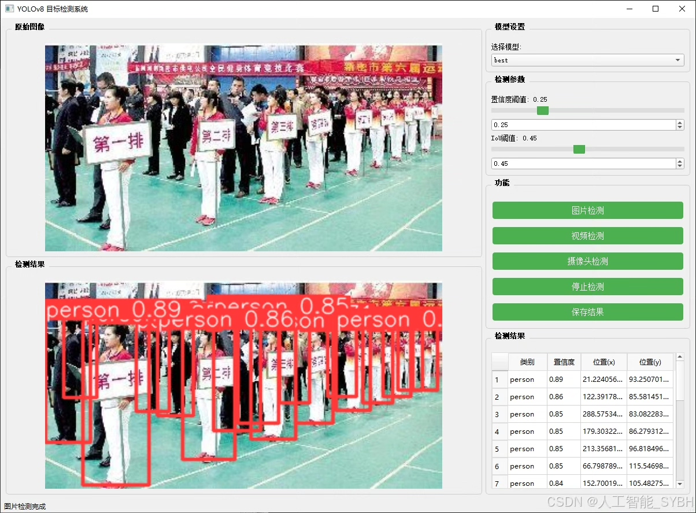
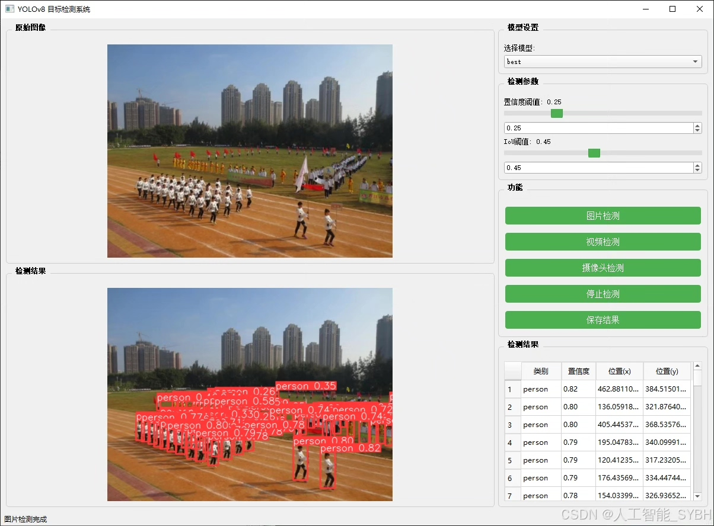
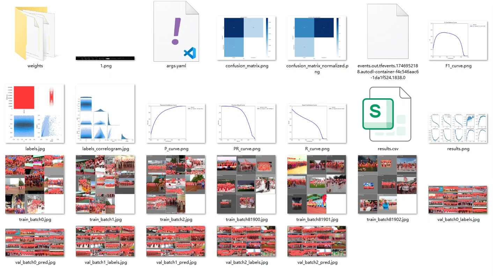
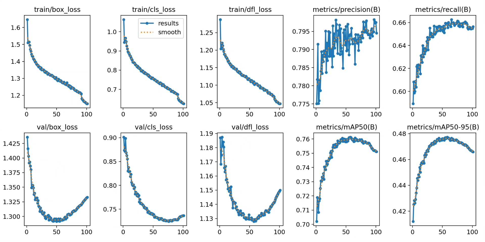
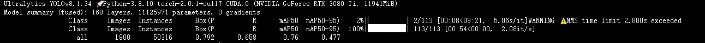
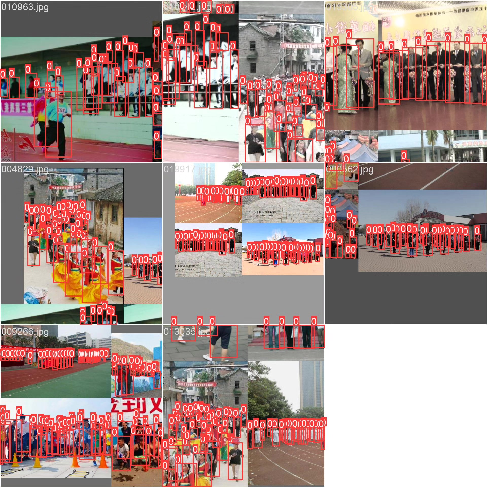
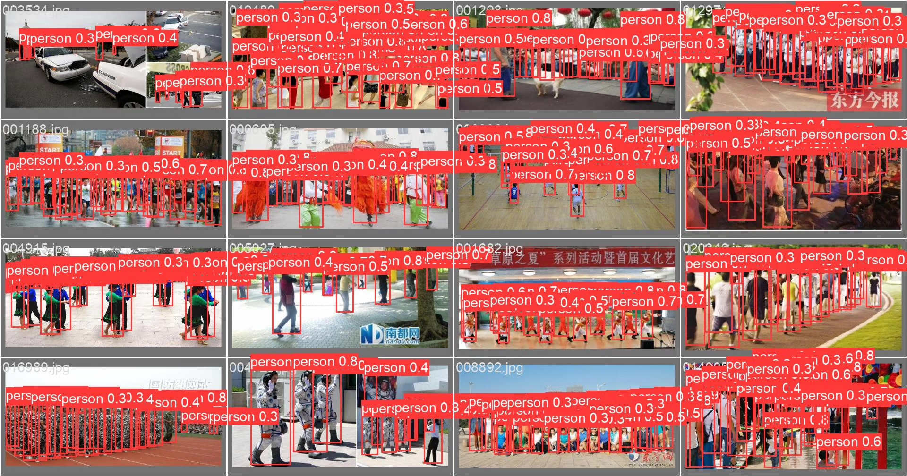
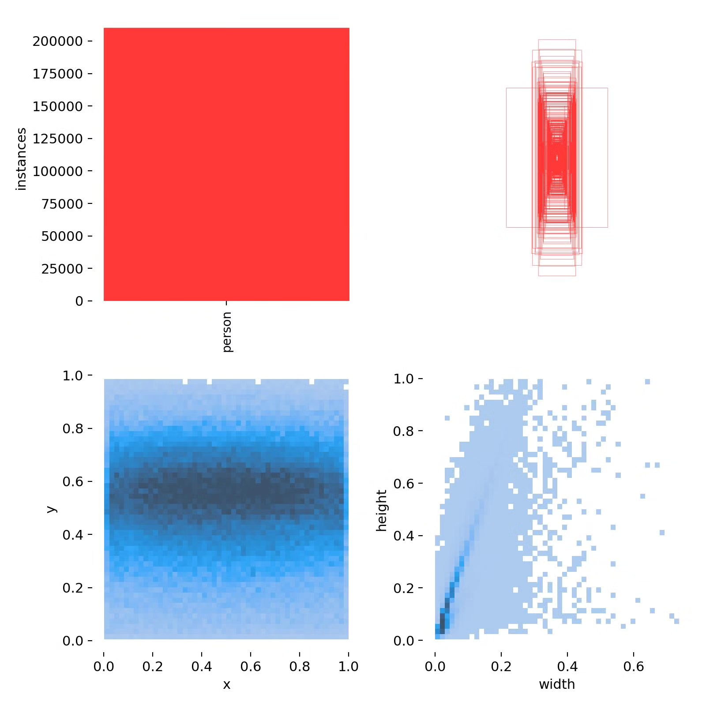

# Based on deep learning YOLOv8 for dense pedestrian detection system (YOLOv8+Y)

## Body

Based on the YOLOv8 object detection algorithm, this project has developed a pedestrian detection system specifically for dense scenes. The system is trained and validated using a custom dataset, which includes 7200 labeled images in the training set and 1800 labeled images in the validation set, all of which contain only the "person" category (nc=1). This system has been optimized for crowded scenes and can achieve high accuracy and real-time pedestrian detection in complex environments. It can be widely applied to public safety monitoring, crowd flow statistics, intelligent traffic management, and other fields.

The company's products have obtained YOLO official commercial license certification.

We provide after-sales service.

After payment, we will provide WeChat IDs to answer questions at any time.

Environment configuration: We will provide an environment configuration tutorial, and WeChat will provide answers.

Remote installation services: If you need remote configuration, an additional fee of 69 is required, with all fees refunded if the configuration fails (only the installation fee is refunded for older computers).

Retraining datasets: After configuring the environment, you can train on your own computer. If you need us to retrain, just pay 69 plus computing power fees (2.5 yuan/hour).

Full after-sales service

## Images

## Payment

Here is a pay link on Stripe ( https://buy.stripe.com/3cs8yP7sY87d0vu9AB ). Please contact me lonlonago@foxmail.com after funding $89, and I will send you a complete data files , thank you!

